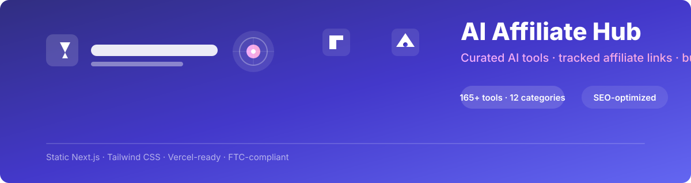
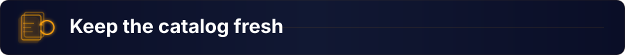

<p align="center">
  
</p>

<p align="center">
  <b>A ready-to-run AI affiliate site with SEO plumbing, click tracking, and FTC compliance built in.</b><br>
  Curated AI tools by category · per-tool SEO pages · outbound redirect tracking · disclosure &amp; sitemap out of the box.
</p>

<p align="center">
  
  
  
  
  
  
</p>

<p align="center">
  <a href="#-quick-start"></a>
  &nbsp;
  <a href="#-put-it-online"></a>
  &nbsp;
  <a href="#-legal--compliance"></a>
</p>

<br>

## 🧭 Contents

- ✨ [Features](#features)
- 🛠️ [What's in this project](#whats-in-this-project)
- 🚀 [Quick start](#quickstart)
- ⚙️ [Configuration](#config)
- 🔗 [Get your own affiliate links](#affiliate-links)
- 📈 [Understand the business](#business)
- 🌐 [Put it online](#deploy)
- 🏗️ [Architecture](#architecture)
- ⚖️ [Legal &amp; compliance](#legal)
- 📦 [Keep the catalog fresh](#fresh)

<br>

<a name="features"></a>


<br>

Every feature is wired end-to-end. No stubs, no placeholders that need a backend to work.

<table>
  <tr>
    <td width="33%" valign="top">
      <h3>📂 Curated catalog</h3>
      165+ AI tools across 12 categories, stored in a plain JSON file you can edit by hand or with the included wizard. Each tool gets its own SEO page.
    </td>
    <td width="33%" valign="top">
      <h3>🔍 Live search &amp; filters</h3>
      Client-side search and category filtering on the homepage. No database, no API calls — fast, free, and works offline.
    </td>
    <td width="33%" valign="top">
      <h3>🔗 Click tracking</h3>
      Every outbound link routes through a redirector that logs the click. Spot-check in Vercel logs, or plug in GA4 for full analytics.
    </td>
  </tr>
  <tr>
    <td valign="top">
      <h3>📄 Per-tool SEO pages</h3>
      Every tool gets a dedicated `/tool/[slug]` page with unique metadata, ready to index. Categories get their own landing pages too.
    </td>
    <td valign="top">
      <h3>📋 Sitemap &amp; metadata</h3>
      Auto-generated `sitemap.xml`, Open Graph tags, and per-page titles. Submit to Google Search Console and start compounding.
    </td>
    <td valign="top">
      <h3>⚖️ FTC compliance</h3>
      A legally required disclosure page and an affiliate badge on every sponsored card. Stay compliant without thinking about it.
    </td>
  </tr>
</table>

<details>
<summary><b>🧭 How the site is structured</b> &nbsp;·&nbsp; click to expand</summary>

The site is a static Next.js application. No server, no database, no build step you have to manage — Vercel handles it.

| Layer | What it does |
| --- | --- |
| **Pages** | App Router pages: homepage, category landing pages, tool pages, redirector, disclosure. |
| **Data** | `data/products.json` is the single source of truth. The wizard, the build script, and the pages all read from it. |
| **Components** | Reusable UI pieces: product cards, search bar, navigation, footer, analytics hook. |
| **Config** | `lib/site-config.ts` controls your site name, tagline, URL, and disclosure text — change it once and it flows everywhere. |

</details>

<br>

<a name="whats-in-this-project"></a>


<br>

```text
app/
  page.tsx               Homepage — hero, featured tools, search + filters
  category/[slug]/       One page per category
  tool/[slug]/           One page per a tool — good for SEO
  go/[slug]/             Outbound link redirector for tracking
  disclosure/            Legally-required affiliate disclosure page
  sitemap.ts             Auto-generated sitemap.xml for Google
components/              Reusable UI pieces (product card, search bar, nav, footer)
data/
  products.json          Every tool on the site. Edit this most.
  products.csv           Same data, spreadsheet-friendly
  source-list-raw.csv    The original creator's list, kept for reference
lib/
  site-config.ts         Your site's name, tagline, and disclosure text
  products.ts            Helper functions the pages use to read products.json
scripts/
  add-product.mjs        Interactive wizard to add a tool — no code needed
  build-catalog.mjs      Re-categorizes raw data into products.json
```

<br>

<a name="quickstart"></a>


<br>

You need two free programs: **Node.js** (to run the project) and a code editor like **VS Code**.

```bash
# 1 · clone or download this repo
git clone https://github.com/printezy247/AiAffil.git
cd AiAffil

# 2 · install dependencies
npm install

# 3 · run the site locally
npm run dev
```

Open **http://localhost:3000** — that is your site, running on your machine.

Leave the terminal window open while you work. Press <kbd>Ctrl+C</kbd> to stop the server.

**Verify everything works:**

```bash
npm run build   # production build — catches broken code before you deploy
npm run lint    # code style check
```

<details>
<summary><b>🛠️ Useful commands reference</b> &nbsp;·&nbsp; click to expand</summary>

| Command | What it does |
| --- | --- |
| `npm install` | Install dependencies (run once, or after pulling updates) |
| `npm run dev` | Run the site locally at localhost:3000 |
| `npm run build` | Build the production version (also catches broken code before you deploy) |
| `npm run lint` | Check code style/errors |
| `node scripts/add-product.mjs` | Interactive wizard to add one new tool |
| `node scripts/build-catalog.mjs` | Re-categorize `data/parsed-raw.json` into `data/products.json` (keeps your hand-edits) |

</details>

<br>

<a name="config"></a>


<br>

Open `lib/site-config.ts`. Every public value on the site flows from this file.

<details>
<summary><b>⚙️ Every setting</b> &nbsp;·&nbsp; click to expand</summary>

| Variable | Purpose |
| --- | --- |
| `name` | Site name shown in the header, title tag, and footer. |
| `tagline` | Short line under the logo on the homepage. |
| `description` | Meta description for SEO and social sharing. |
| `url` | Your live domain — used in sitemap, OG tags, and canonical URLs. |
| `socials` | Links shown in the footer. |
| `disclosureText` | The FTC disclosure text shown on `/disclosure` and in the footer. |

</details>

<details>
<summary><b>📊 Analytics (optional)</b> &nbsp;·&nbsp; click to expand</summary>

For pageview tracking, create a free [Google Analytics 4](https://analytics.google.com) property and copy its Measurement ID (`G-XXXXXXX`).

Set it as an environment variable:

```bash
# local testing
cp .env.example .env.local
# then add: NEXT_PUBLIC_GA_ID=G-XXXXXXX
```

Or in Vercel: **your project → Settings → Environment Variables**. `components/Analytics.tsx` picks it up automatically.

</details>

<br>

<a name="affiliate-links"></a>


<br>

**Read this before you publish.** The starter data in `data/products.json` was built from a spreadsheet a YouTuber shared publicly. Most of those links are **that creator's own affiliate links** — if you publish the site as-is, clicks and signups earn commissions for *them*, not you.

`isAffiliateLink: true` marks every sponsored card. Here is how to swap them for your own tracking links:

1. Open the tool's website directly (not through this site).
2. Look for "Affiliates," "Partners," "Referral Program," or "Affiliate Program" in the footer. Not every tool has one — that is fine, leave those links as-is or remove the tool.
3. Sign up (usually free; approval can take a few days).
4. Once approved, copy your unique tracking link from the dashboard.
5. Open `data/products.json`, find the tool, and replace its `url` value with your new link.

Tools with `isAffiliateLink: false` (mostly free utilities) do not need this — they either have no commission, or are flagged for you to add your own link once you join the program.

This is naturally gradual work. Many affiliate marketers start with 5–10 tools they have personally used, get those programs approved, and grow the list over time. A smaller, honest list converts better than a huge list of links you have never tried.

<br>

<a name="business"></a>


<br>

**How the money works.** You link to a tool using your affiliate link. A visitor clicks, signs up (sometimes needs to become a paying customer, depending on the program), and the company pays you a commission — sometimes a flat bounty, often a recurring percentage of what that customer pays for as long as they stay subscribed. That is why AI SaaS affiliate programs are attractive: one signup can pay out monthly for years.

**Where visitors come from — the site alone will not get traffic.** A directory site earns nothing until people find it. Realistic paths, in rough order of effort-to-payoff for a beginner:

| Channel | Effort | Payoff | Notes |
| --- | :---: | :---: | --- |
| **SEO** | Low | Slow, compounding, free | Every tool and category page is already indexable. Submit your sitemap to Google Search Console and wait months, not days. |
| **Short-form video** | High | Faster | YouTube Shorts, TikTok, Reels — review or demo one tool at a time and link the site in your bio. |
| **Email list** | Medium | Compounds | Capture emails and send a weekly "tool I tried this week" — converts far better than cold traffic. |
| **Paid ads** | High | Fastest, riskiest | Not recommended until organic traffic proves which tools and angles actually convert. |

**Legal requirement, not optional.** U.S. FTC rules require you to disclose affiliate relationships clearly. This site already has a `/disclosure` page and a disclosure line in the footer of every page — keep both. If you also promote a specific tool on social media, add a short disclosure there too (e.g. `#ad` or "contains an affiliate link").

<br>

<a name="deploy"></a>


<br>

[Vercel](https://vercel.com) is made by the creators of Next.js and hosts projects like this one for free.

```bash
# 1 · create a GitHub repo and push
git init
git add .
git commit -m "My AI affiliate site"
# then create an empty repo on GitHub and follow the push instructions

# 2 · deploy on Vercel
#    Click "Add New → Project" in Vercel, pick the repo, leave defaults, click Deploy.

# 3 · your site is live
#    A couple minutes later you get a URL like https://your-project.vercel.app
```

Any time you `git push` new changes, Vercel redeploys automatically.

<details>
<summary><b>☁️ Get a custom domain</b> &nbsp;·&nbsp; click to expand</summary>

A `.com` domain costs about $10–15/year from [Namecheap](https://www.namecheap.com) or [Porkbun](https://porkbun.com). Buy one, then in Vercel: **your project → Settings → Domains → add it**. Vercel shows you exactly which DNS records to add at your registrar. Once it propagates, update `url` in `lib/site-config.ts` to match.

</details>

<details>
<summary><b>🛡️ Operating it reliably</b> &nbsp;·&nbsp; click to expand</summary>

- **Preview deployments.** Every push creates a preview URL so you can review changes before they hit production.
- **Environment variables.** Set `NEXT_PUBLIC_GA_ID` and any other config in Vercel → Settings → Environment Variables.
- **Analytics.** `components/Analytics.tsx` picks up `NEXT_PUBLIC_GA_ID` automatically. Plug in GA4 for full click and pageview tracking.
- **Rebuilding the catalog.** If you edit `products.json` by hand at scale, run `node scripts/build-catalog.mjs` to re-categorize without losing your hand-edits.

</details>

<br>

<a name="architecture"></a>


<br>

**Request path.** Visitor hits `/tool/[slug]` → Next.js renders the page from `data/products.json` → meta tags, OG image, and canonical URL are set from site config → visitor clicks "Visit" → routes through `/go/[slug]` → logs the click → redirects to the affiliate URL.

<details>
<summary><b>🗂️ Project layout</b> &nbsp;·&nbsp; click to expand</summary>

```text
app/
  page.tsx                  Homepage — hero, featured tools, search + filters
  category/[slug]/          One page per category (e.g. /category/seo-and-growth-marketing)
  tool/[slug]/              One page per tool (e.g. /tool/syllaby) — good for SEO
  go/[slug]/                Outbound link redirector (see "Track clicks" below)
  disclosure/               Legally-required affiliate disclosure page
  sitemap.ts                Auto-generated sitemap.xml for Google
components/                 Reusable UI pieces (product card, search bar, nav, footer)
data/
  products.json             Every tool on the site. This is the file you'll edit most.
  products.csv              Same data, spreadsheet-friendly (open in Excel/Sheets)
  source-list-raw.csv       The original creator's list, kept for reference
lib/
  site-config.ts            Your site's name, tagline, and disclosure text
  products.ts               Helper functions the pages use to read products.json
scripts/
  add-product.mjs           Interactive "add a tool" wizard — no code editing needed
  build-catalog.mjs         Re-categorizes data/parsed-raw.json into data/products.json (keeps your hand-edits)
```

</details>

<br>

<a name="legal"></a>


<br>

This site ships with two compliance layers:

| Layer | Where it lives | What it does |
| --- | --- | --- |
| **Disclosure page** | `app/disclosure/page.tsx` | Full FTC-compliant affiliate disclosure, linked from every page footer. |
| **Affiliate badge** | `components/ProductCard.tsx` | Every tool with `isAffiliateLink: true` shows an "Affiliate" badge so visitors know. |

Keep both. If you promote specific tools on social media, add a short disclosure there too (e.g. `#ad` or "contains an affiliate link").

<br>

<a name="fresh"></a>



<br>

An affiliate directory that never changes goes stale — new AI tools launch constantly, and being early to list a fast-growing tool is one of the few edges a small site has.

**Add tools with the wizard:**

```bash
node scripts/add-product.mjs
```

It asks you a few questions — tool name, link, description, category — and saves the new tool straight into `data/products.json`. Restart `npm run dev` (or just wait — it hot-reloads) to see it live.

**Ask an AI to research and add tools for you.** If you are using Claude (or Claude Code) to work on this project, you can literally ask:

> "Search for the 5 fastest-growing AI video-editing tools right now, check whether they have an affiliate program, and add the ones that do to `data/products.json` using the same format as the existing entries."

That is exactly how the tools tagged **"🔥 High-demand pick found via live research"** already in your catalog were added. Their `url` currently points at the tool's homepage, not an affiliate link — join each program and swap in your tracked link before you promote them.

<details>
<summary><b>💡 Tips for growing the catalog</b> &nbsp;·&nbsp; click to expand</summary>

- **Start small.** 5–10 tools you have genuinely used beat 165 random links every time.
- **Narrow your niche.** A site covering "AI video editors" converts better than a site covering "everything AI."
- **Check programs monthly.** Affiliate terms change; a link that still works today may expire or change its cookie window.
- **Use the `isAffiliateLink` flag.** Set it to `false` for tools you have not yet joined a program for — that way the badge logic stays accurate.
- **Update `source-list-raw.csv`** when you import a new reference list, so you can diff against your current catalog and spot gaps.

</details>

<hr>

<p align="center">
  <b>Built with</b>
  <a href="https://nextjs.org">Next.js</a> (React) + <a href="https://tailwindcss.com">Tailwind CSS</a>, deployed on <a href="https://vercel.com">Vercel</a>.
  <br>
  <a href="https://github.com/printezy247/AiAffil">AiAffil</a> · <a href="https://printezy.money">printezy.money</a> · MIT License
</p>
